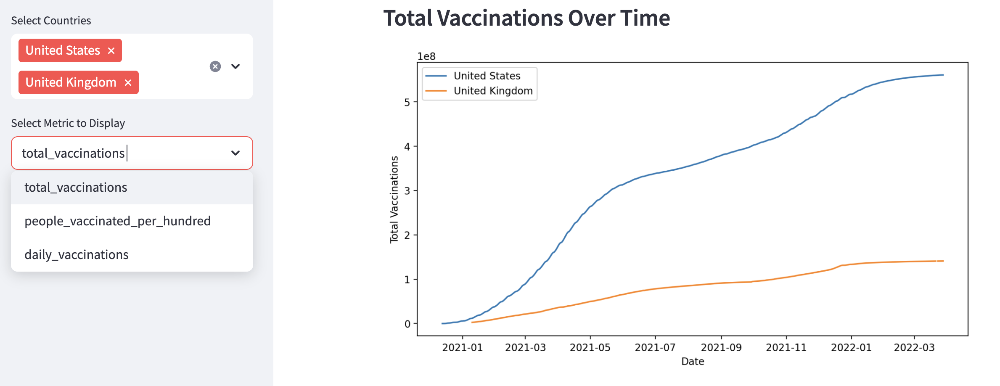
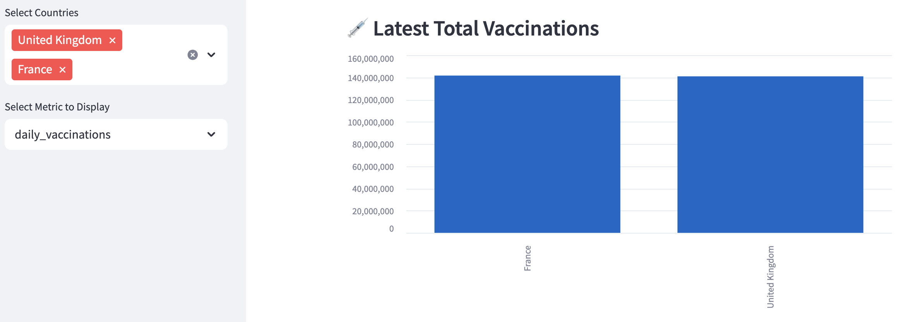

# COVID-19 Vaccine Tracker App

This interactive Streamlit app visualizes global COVID-19 vaccination progress using data from Our World In Data.

## Features
- Select countries and metrics to explore vaccination data
- Line charts and bar plots over time
- Summary statistics (mean, median, max, etc.)
- Correlation matrix
- Linear regression trend analysis

  
  

## Run the App 

1. Clone this repo:
2. Install dependencies:
3. Run the app:

## Dataset

Source: [Our World in Data – COVID Vaccination Data](https://www.kaggle.com/datasets/gpreda/covid-world-vaccination-progress)

## Built With

- Python
- Pandas
- Streamlit
- Matplotlib
- Seaborn
